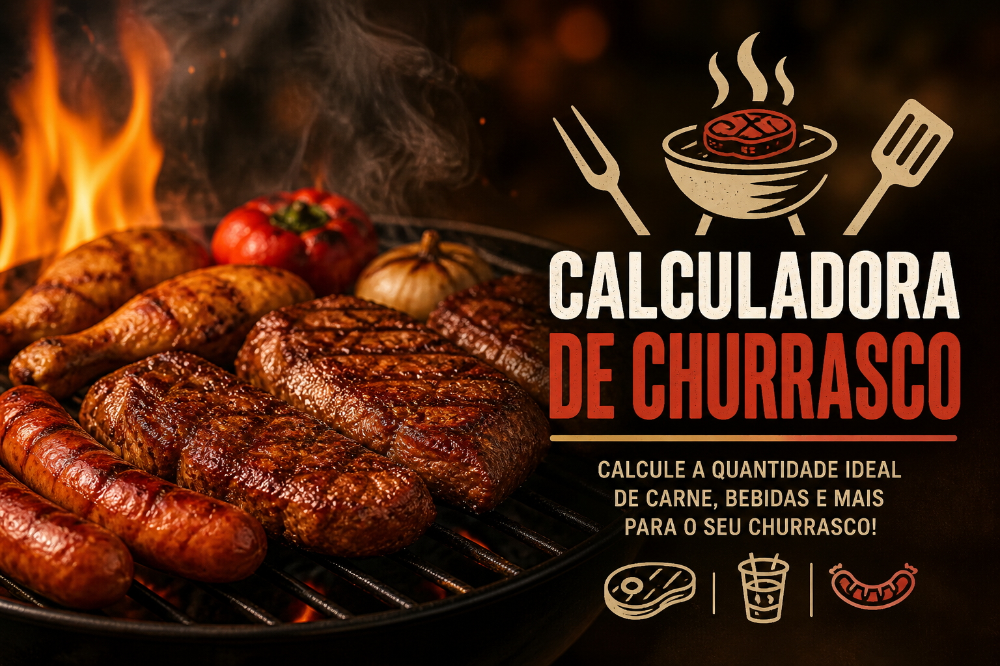

# 🧮 Projeto Calculadora de Churrasco

Uma aplicação web moderna e responsiva desenvolvida para calcular automaticamente a quantidade ideal de alimentos para um churrasco.
O sistema considera diferentes perfis de pessoas e gera uma estimativa inteligente de consumo.

---

## 🚀 Demonstração

O sistema permite informar a quantidade de:

* 👨 Homens
* 👩 Mulheres
* 🧒 Crianças

E calcula automaticamente:

* 🥩 Carne bovina
* 🍗 Frango
* 🌭 Linguiça
* 🥤 Refrigerante
* 🍺 Cerveja

---

## ✨ Funcionalidades

* ✅ Cálculo automático de churrasco
* ✅ Interface moderna
* ✅ Design responsivo
* ✅ Efeitos visuais suaves
* ✅ Inputs estilizados
* ✅ Resultado dinâmico
* ✅ Animações em CSS
* ✅ Efeito Glassmorphism
* ✅ Validação básica dos campos

---

## 🛠️ Tecnologias Utilizadas

* HTML5
* CSS3
* JavaScript
* Google Fonts
* Flexbox

---

## 📱 Responsividade

O projeto foi desenvolvido para funcionar perfeitamente em:

* 📱 Smartphones
* 📲 Tablets
* 💻 Notebooks
* 🖥️ Monitores Desktop

---

## 🎨 Design

* Interface moderna e intuitiva
* Layout com efeito **Glassmorphism**
* Foco em **UX (Experiência do Usuário)**
* Animações suaves e interativas

---

## 🖼️ Preview do Projeto

---

## 🔗 Acesse o Projeto

👉 [Clique aqui para acessar](https://giovanni-goulart.github.io/Projeto-Calculadora/)

---

## 📄 Licença

Este projeto está sob a licença MIT.

---

## 👨‍💻 Autor

Desenvolvido por **Giovanni Goulart**

